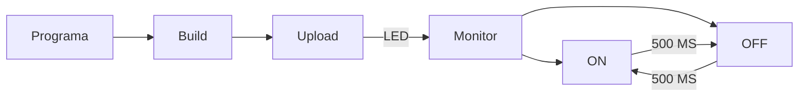

# PRÀCTICA 1

## Codigo:

```
#include <Arduino.h>
#define LED 0

void setup() {
    Serial.begin(115200);
    pinMode(LED,OUTPUT);
}

void loop() {
    delay(500);
    Serial.println("ON");
    digitalWrite(LED,HIGH);
    delay(500);
    Serial.println("OFF");
    digitalWrite(LED,LOW);
}

```


## Diagrama de flujos:





