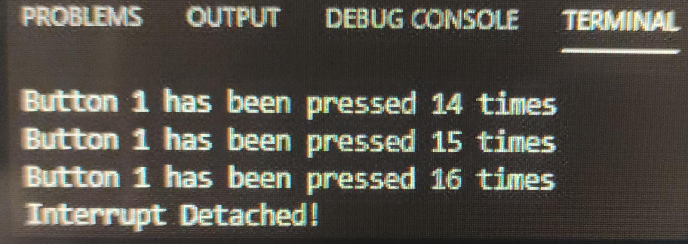

# Práctica 2 Parte 1

## Código:

```
#include <Arduino.h>

struct Button {
  const uint8_t PIN;
  uint32_t numberKeyPresses;
  bool pressed;
};

Button button1 = {18, 0, false};

void IRAM_ATTR isr() {
  button1.numberKeyPresses += 1;
  button1.pressed = true;
}

void setup() 
{
  Serial.begin(115200);
  pinMode(button1.PIN, INPUT_PULLUP);
  attachInterrupt(button1.PIN, isr, FALLING);
}

void loop() 
{
  if (button1.pressed) {
    Serial.printf("Button 1 has been pressed %u times\n", button1.numberKeyPresses);
    button1.pressed = false;
  }

//Detach Interrupt after 1 Minute

static uint32_t lastMillis = 0;

  if (millis() - lastMillis > 60000) {
    lastMillis = millis();
    detachInterrupt(button1.PIN);
    Serial.println("Interrupt Detached!");
  }

}
```
## Salida:

Despues de compilar y subir el codigo a la placa, podem ver que por pantalla nos saldra un texto diciendonos cuantas veces se ha pulsado el boton desde que se ha encendido el programa. Esto lo podemos ver en la siguiente foto:




## Funcionamiento:
Para empezar, podemos ver como lo primero que hacemos es declarar la libreria que vamos a usar, seguidamente hacemos un struct que nos va a dejar assignar un pin a la salida para el pulsador.<br>
Con este boton lo que haremos sera crear interrupciones. Por otra parte tambien tendremos una seccion de codigo que lo que hara sera contar cuantas veces se ha pulsado este boton, es decir cuantas interrupciones se han hecho, asi pues el programa nos mostrara por pantalla la siguiente linea "Button 1 has been pressed %u times" donde
"%u" sera el numero de veces que ha sido pulsado.<br>
Finalmente si el boton no se ha pulsado durante >1minuto, se mostrara el mensaje de "Interrupt Detached!".


