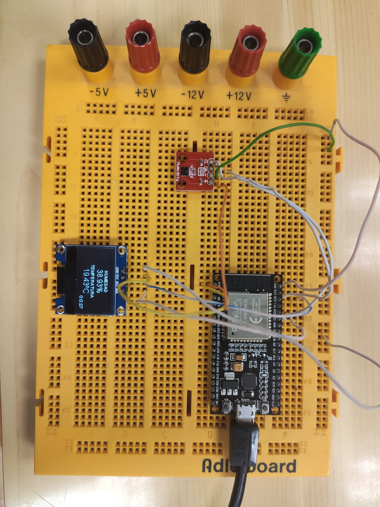

# Práctica 5 Web:
### Código:

```
/*********
  Rui Santos
  Complete project details at https://randomnerdtutorials.com  
*********/

// Import required libraries
#include "WiFi.h"
#include "ESPAsyncWebServer.h"
#include <Adafruit_Sensor.h>
#include "SparkFunHTU21D.h"
#include <Wire.h> 
#include "SSD1306Wire.h" 

// Replace with your network credentials
const char* ssid = "Xiaomi_11T_Pro";
const char* password = "f5cbd8a82232";

     // Digital pin connected to the DHT sensor

// Uncomment the type of sensor in use:
//#define DHTTYPE    DHT11     // DHT 11     // DHT 22 (AM2302)
//#define DHTTYPE    DHT21     // DHT 21 (AM2301)

float temp = 0;
float humd = 0;


HTU21D myHumidity;

SSD1306Wire display(0x3c, SDA, SCL); 

// Create AsyncWebServer object on port 80
AsyncWebServer server(80);

String readmyHumiditytemperature() {
  // Sensor readings may also be up to 2 seconds 'old' (its a very slow sensor)
  // Read temperature as Celsius (the default)
  float t = temp;
  // Read temperature as Fahrenheit (isFahrenheit = true)
  //float t = dht.readTemperature(true);
  // Check if any reads failed and exit early (to try again).
  if (isnan(t)) {    
    Serial.println("Failed to read from DHT sensor!");
    return "--";
  }
  else {
    Serial.println(t);
    return String(t);
  }
}

String readmyHumidityHumidity() {
  // Sensor readings may also be up to 2 seconds 'old' (its a very slow sensor)
  float h = humd;
  if (isnan(h)) {
    Serial.println("Failed to read from DHT sensor!");
    return "--";
  }
  else {
    Serial.println(h);
    return String(h);
  }
}

const char index_html[] PROGMEM = R"rawliteral(
<!DOCTYPE HTML><html>
<head>
  <meta name="viewport" content="width=device-width, initial-scale=1">
  <link rel="stylesheet" href="https://use.fontawesome.com/releases/v5.7.2/css/all.css" integrity="sha384-fnmOCqbTlWIlj8LyTjo7mOUStjsKC4pOpQbqyi7RrhN7udi9RwhKkMHpvLbHG9Sr" crossorigin="anonymous">
  <style>
    html {
     font-family: Arial;
     display: inline-block;
     margin: 0px auto;
     text-align: center;
    }
    h2 { font-size: 3.0rem; }
    p { font-size: 3.0rem; }
    .units { font-size: 1.2rem; }
    .dht-labels{
      font-size: 1.5rem;
      vertical-align:middle;
      padding-bottom: 15px;
    }
  </style>
</head>
<body>
  <h2>ESP32 DHT Server</h2>
  <p>
    <i class="fas fa-thermometer-half" style="color:#059e8a;"></i> 
    <span class="dht-labels">Temperature</span> 
    <span id="temperature">%TEMPERATURE%</span>
    <sup class="units">&deg;C</sup>
  </p>
  <p>
    <i class="fas fa-tint" style="color:#00add6;"></i> 
    <span class="dht-labels">Humidity</span>
    <span id="humidity">%HUMIDITY%</span>
    <sup class="units">&percnt;</sup>
  </p>
</body>
<script>
setInterval(function ( ) {
  var xhttp = new XMLHttpRequest();
  xhttp.onreadystatechange = function() {
    if (this.readyState == 4 && this.status == 200) {
      document.getElementById("temperature").innerHTML = this.responseText;
    }
  };
  xhttp.open("GET", "/temperature", true);
  xhttp.send();
}, 10000 ) ;

setInterval(function ( ) {
  var xhttp = new XMLHttpRequest();
  xhttp.onreadystatechange = function() {
    if (this.readyState == 4 && this.status == 200) {
      document.getElementById("humidity").innerHTML = this.responseText;
    }
  };
  xhttp.open("GET", "/humidity", true);
  xhttp.send();
}, 10000 ) ;
</script>
</html>)rawliteral";

// Replaces placeholder with DHT values
String processor(const String& var){
  //Serial.println(var);
  if(var == "TEMPERATURE"){
    return readmyHumiditytemperature();
  }
  else if(var == "HUMIDITY"){
    return readmyHumidityHumidity();
  }
  return String();
}

void setup(){

  display.init();

  display.flipScreenVertically();
  display.setFont(ArialMT_Plain_10);

  // Serial port for debugging purposes
  Serial.begin(115200);

  myHumidity.begin();
  
  // Connect to Wi-Fi
  WiFi.begin(ssid, password);
  while (WiFi.status() != WL_CONNECTED) {
    delay(1000);
    Serial.println("Connecting to WiFi..");
  }

  // Print ESP32 Local IP Address
  Serial.println(WiFi.localIP());

  // Route for root / web page
  server.on("/", HTTP_GET, [](AsyncWebServerRequest *request){
    request->send_P(200, "text/html", index_html, processor);
  });
  server.on("/temperature", HTTP_GET, [](AsyncWebServerRequest *request){
    request->send_P(200, "text/plain", readmyHumiditytemperature().c_str());
  });
  server.on("/humidity", HTTP_GET, [](AsyncWebServerRequest *request){
    request->send_P(200, "text/plain", readmyHumidityHumidity().c_str());
  });

  // Start server
  server.begin();
}
 
void loop(){
humd = myHumidity.readHumidity();
   temp = myHumidity.readTemperature();

  Serial.print("Time:");
  Serial.print(millis());
  Serial.print(" Temperature:");
  Serial.print(temp, 1);
  Serial.print("C");
  Serial.print(" Humidity:");
  Serial.print(humd, 1);
  Serial.print("%");

  Serial.println();


  // clear the display
  display.clear();
  // draw the current demo method
  //demos[demoMode]();


  display.setTextAlignment(TEXT_ALIGN_CENTER);
  display.setFont(ArialMT_Plain_10);
  display.drawString(128/2, 0, "HUMEDAD");
  display.setFont(ArialMT_Plain_16);
  display.drawString(128/2, 11, String(humd)+ "%");
  display.setFont(ArialMT_Plain_10);
  display.drawString(128/2, 30, "TEMPERATURA");
  display.setFont(ArialMT_Plain_16);
  display.drawString(128/2, 41, String(temp)+ "ºC");

  display.setFont(ArialMT_Plain_10);
  display.setTextAlignment(TEXT_ALIGN_RIGHT);
  display.drawString(128, 54, String(millis()/3600000)+String(":")\
          +String((millis()/60000)%60)+String(":")\
          +String((millis()/1000)%(60)));
 
  

  // write the buffer to the display
  display.display();

  
  
  delay(100);
}
```

### Salida:
En este caso se parace mucho al apartado del display, solo que esta vez se implementa un paso mas usando la conexion Wi-Fi de la placa ESP32, ya que esta vez las lecturas tambien saldran por una pagina web.

Por lo tanto se nos muestra lo siguiente
: 
#### Web:
Por pantalla se nos dara una IP en la cual tendremos que acceder con un dispositivo conectado a esta misma red, esto hara que podamos ver estas lecturas sin al necesidad de un display.

#### Display:
Por el display muestra ambas lecturas de temperatura y humedad de manera comoda y organizada como se ve en el siguiente video.

En el siguiente video vemos el funcionamiento de la pagina Web:


https://user-images.githubusercontent.com/100867309/171384964-9294a8af-5554-4500-a035-f13621edd993.mp4


### Montaje:
El montaje es el mismo pero aun asi lo mostramos otra vez para que no haya confusiones:



### Aclaraciones del código:

En este caso como ya hemos dicho la mayor parte del codigo es similar a la anterior ya que el display es el mismo, aun asi la parte de la web es la que hay que tener en cuenta, ya esta hecha en HTML como se puede ver a continuacion;
```
<!DOCTYPE HTML><html>
<head>
  <meta name="viewport" content="width=device-width, initial-scale=1">
  <link rel="stylesheet" href="https://use.fontawesome.com/releases/v5.7.2/css/all.css" integrity="sha384-fnmOCqbTlWIlj8LyTjo7mOUStjsKC4pOpQbqyi7RrhN7udi9RwhKkMHpvLbHG9Sr" crossorigin="anonymous">
  <style>
    html {
     font-family: Arial;
     display: inline-block;
     margin: 0px auto;
     text-align: center;
    }
    h2 { font-size: 3.0rem; }
    p { font-size: 3.0rem; }
    .units { font-size: 1.2rem; }
    .dht-labels{
      font-size: 1.5rem;
      vertical-align:middle;
      padding-bottom: 15px;
    }
  </style>
</head>
<body>
  <h2>ESP32 DHT Server</h2>
  <p>
    <i class="fas fa-thermometer-half" style="color:#059e8a;"></i> 
    <span class="dht-labels">Temperature</span> 
    <span id="temperature">%TEMPERATURE%</span>
    <sup class="units">&deg;C</sup>
  </p>
  <p>
    <i class="fas fa-tint" style="color:#00add6;"></i> 
    <span class="dht-labels">Humidity</span>
    <span id="humidity">%HUMIDITY%</span>
    <sup class="units">&percnt;</sup>
  </p>
</body>
<script>
setInterval(function ( ) {
  var xhttp = new XMLHttpRequest();
  xhttp.onreadystatechange = function() {
    if (this.readyState == 4 && this.status == 200) {
      document.getElementById("temperature").innerHTML = this.responseText;
    }
  };
  xhttp.open("GET", "/temperature", true);
  xhttp.send();
}, 10000 ) ;

setInterval(function ( ) {
  var xhttp = new XMLHttpRequest();
  xhttp.onreadystatechange = function() {
    if (this.readyState == 4 && this.status == 200) {
      document.getElementById("humidity").innerHTML = this.responseText;
    }
  };
  xhttp.open("GET", "/humidity", true);
  xhttp.send();
}, 10000 ) ;
</script>
</html>)rawliteral";

```
Tambien tenemos que ver como incializamos la pagina web conectandonos a una red Wi-Fi como se ve al principio del codigo:
```
// Replace with your network credentials
const char* ssid = "Xiaomi_11T_Pro";
const char* password = "f5cbd8a82232";

```

De esta forma conectamos la placa a la red Wi-Fi assignada y ya podriamos ver la pagina web con las lecturas actualizadas constantemente.
