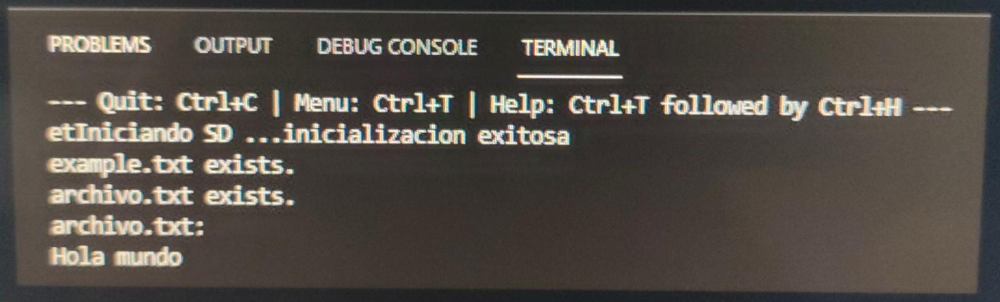

# Práctica 6 Parte 1:
### Código:
```
#include <Arduino.h>
#include <SPI.h>
#include <SD.h>

File myFile;

void setup()
{
    Serial.begin(115200);
    Serial.print("Iniciando SD ...");
    SPI.begin(18,19,23,5);

    if (!SD.begin(5)) {
        Serial.println("No se pudo inicializar");
        return;
    }
    Serial.println("inicializacion exitosa");
    
    if(!SD.exists("/archivo.txt")){
            Serial.println("example.txt exists.");
    }

    else{
            Serial.println("example.txt no exists.");
    }

    myFile = SD.open("/archivo.txt", FILE_WRITE);
    myFile.close();

    if (SD.exists("/archivo.txt")){


            Serial.println("archivo.txt exists. ");
    }
    else{
            Serial.println("archivo.txt doesn't exist");
    }
    myFile = SD.open("/archivo.txt", FILE_WRITE);//abrimos  el archivo 
    myFile.println("Hola mundo");
    myFile.close();
    myFile=SD.open("/archivo.txt");
    if (myFile) {
        Serial.println("archivo.txt:");
        while (myFile.available()) {
            Serial.write(myFile.read());
        }
        myFile.close(); //cerramos el archivo
    } else {
        Serial.println("Error al abrir el archivo");
    }
}

void loop()
{}
```

### Salida:
Este codigo lo que hace es que en la tarjeta SD incorporada en el lector de tarjetas se cree un archivo con un contenido dentro. 
Una vez creado el archivo, el mismo codigo hace que este archivo ya creado se abra y muestra por pantalla su contenido, en el caso de este "Hola mundo":



### Funcionamiento:

Antes de nada hay que declarar las librerias que vamos a usar,las variables,etc... en este caso las siguientes:
```
#include <Arduino.h>
#include <SPI.h>
#include <SD.h>

File myFile;
```

Una vez hecho esto ya podemos empezar en el setup haciendo la comunicación serial, enviando un mensaje conforme iniciamos la tarjeta y declarando los pins necessarios.<br/>
Justo despues se inicializa la tarjeta y en caso de que de error nos mostrara un mensaje por pantalla, por lo contrario tambien nos dira si la inicializacion ha sido existosa.<br/>
Tambien nos avisara de si hay algun fichero dentro de la tarjeta y se nos mostrara por pantalla un mensaje u otro, dependiendo de lo que encuentre.<br/>
Seguidamente se genera un nuevo fichero y se abre para escribir en el el texto deseado y finalmente se nos muestra por pantalla el texto del fichero si todo se ha cumplido. Por otra parte si no se puede abrir el fichero nos mostrara un error por pantalla
```
void setup()
{
    Serial.begin(115200);
    Serial.print("Iniciando SD ...");
    SPI.begin(18,19,23,5);

    if (!SD.begin(5)) {
        Serial.println("No se pudo inicializar");
        return;
    }
    Serial.println("inicializacion exitosa");
    
    if(!SD.exists("/archivo.txt")){
            Serial.println("example.txt exists.");
    }

    else{
            Serial.println("example.txt no exists.");
    }

    myFile = SD.open("/archivo.txt", FILE_WRITE);
    myFile.close();

    if (SD.exists("/archivo.txt")){


            Serial.println("archivo.txt exists. ");
    }
    else{
            Serial.println("archivo.txt doesn't exist");
    }
    myFile = SD.open("/archivo.txt", FILE_WRITE);//abrimos  el archivo 
    myFile.println("Hola mundo");
    myFile.close();
    myFile=SD.open("/archivo.txt");
    if (myFile) {
        Serial.println("archivo.txt:");
        while (myFile.available()) {
            Serial.write(myFile.read());
        }
        myFile.close(); //cerramos el archivo
    } else {
        Serial.println("Error al abrir el archivo");
    }
}
```


